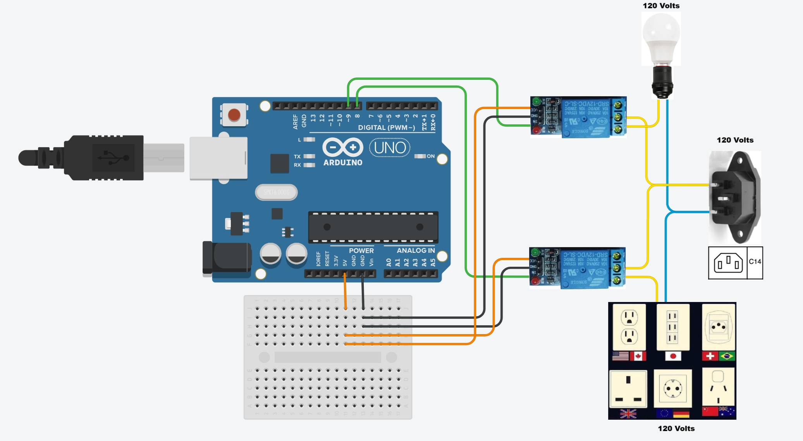

# Arduino Relays Tester - Open Source Project

**Web application for controlling and testing relays using Arduino and Node.js.**

---

## 🧰 Materials Used

List of main components needed to build this project:

- **Arduino Uno** (original or compatible)
- **2x 5V Relay Module** (1 channel each)
- **Mini Breadboard** (small prototyping board)
- **USB Data Cable** (to connect Arduino to the computer)
- **IEC 60320 C14 Connector** (standard international power connector)
- **C14 Standard Power Cable** (for electrical power)
- **Jumper Wires**
- **Electrical Outlets** (for connecting devices)
- **Lamp Sockets** (or actuators of your choice)
- **Wago Connectors** (or similar, for safe electrical connections)
- **Electrical Wires** (appropriate for 127V or 220V depending on your needs)

> ⚡ **Attention:** Handling devices with AC power must be done very carefully.  
> If you are not experienced, ask for help from a qualified professional to avoid the risk of electric shock.

---

## 📷 Assembly Diagram



> Simple assembly using Arduino Uno and 5V 1-channel relay modules.

---

## 🌐 Features

- Web application with manual relay control and testing.
- Node.js backend for API communication with Arduino.
- WebSockets to avoid errors between relays and application.
- Accessible design for everyone (clear descriptions, proper contrast).
- Modern web interface (light and dark modes).

---

## 🛠 Project Structure
```
/ (root)
├── arduino
│   └── relay_test
│       └── relay_test.ino
├── backend
│   ├── .env
│   ├── .env.example
│   └── server.js
├── frontend
│   └── assets
│       ├── css
│       │   └── style.css
│       ├── js
│       │   └── script.js
│       ├── ArduinoRelaysDiagram.png
│       ├── ArduinoRelays1.jpeg
│       └── ArduinoRelays2.jpeg
│   └── index.html
└── README.md
```

---

## 🚀 How to Run

1. Connect the Arduino via USB.
2. Open the Arduino IDE and upload the firmware located at `arduino/relay_test/relay_test.ino`.
3. In the `backend/` folder, copy `.env.example` to `.env` and adjust if necessary.
4. Install the Node.js backend dependencies:
   ```bash
   cd backend
   npm install
   ```
5. Start the Node.js server:
   ```bash
   node server.js
   ```
6. Open your browser and go to `http://localhost:3000`.
7. Control the relays through the web interface!

> ⚡ **Note:** Ensure that the correct serial port is set in your `.env` file.
---

## 💖 Support this Project

If you liked this project, please consider leaving a ⭐ on GitHub to help it reach more people!  
Your support helps promote accessibility and technological inclusion.

[](https://github.com/GuilhermeHMC/ArduinoRelays/stargazers)

---

## 📜 License

This project is licensed under the [MIT License](LICENSE) [](https://opensource.org/licenses/MIT).

---

## 👨‍💻 About the Author

- **Author**: Guilherme H. M. Cardoso
- **Email**: guihmca@gmail.com
- **LinkedIn**: [Guilherme H. M. Cardoso](https://www.linkedin.com/in/guilherme-henrique-marques-cardoso-a59808213/)
- Passionate about technology, hardware, software, and automation.
- Creating solutions to make the world more accessible and inclusive.

---

> **Disclaimer:** This project is intended for educational purposes and to promote the inclusion of people with disabilities in the fields of technology and automation.
