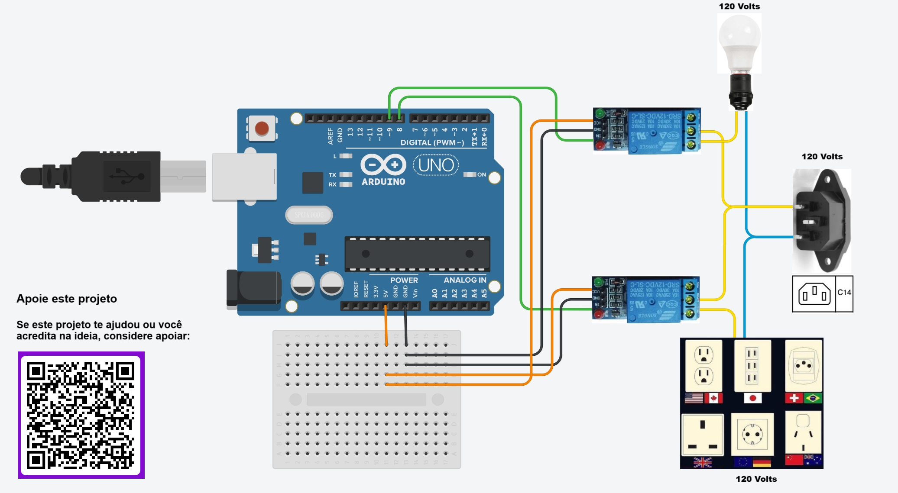

# Arduino Relays Tester - Multilanguage and Accessible - Open Source Project

**Projeto Open Source** Aplicação WEB para controle e teste de relés via Arduino e Node.js, com foco em **acessibilidade**, **modo claro/escuro** e **internacionalização** (Português, Inglês e Francês).


---

## 🧰 Materiais Utilizados

Lista dos principais componentes necessários para a montagem deste projeto:

- **Arduino Uno** (original ou compatível)
- **2x Módulo Relé 5V** (1 canal cada)
- **Mini Protoboard** (placa de ensaio pequena)
- **Cabo de Dados USB** (para conectar o Arduino ao computador)
- **Conector IEC 60320 C14** (entrada de força padrão internacional)
- **Cabo de Força Padrão C14** (para alimentação elétrica)
- **Cabos Jumper**
- **Tomadas Elétricas** (para conectar os dispositivos)
- **Soquetes de Lâmpada** (ou atuadores de sua preferência)
- **Conectores Wago** (ou similares para conexões elétricas seguras)
- **Fios Elétricos** (adequados para 127V ou 220V conforme necessidade)

> ⚡ **Atenção:** A ligação de dispositivos em corrente alternada (127V/220V) deve ser realizada com muito cuidado.  
> Se você não tiver experiência, solicite ajuda de um profissional qualificado para evitar riscos de choque elétrico.

---

## 📷 Diagrama de Montagem



> Montagem simples utilizando Arduino e Módulos Relé 5V 1 Canal.

---

## 🌐 Funcionalidades

- Aplicação Web com controle manual de relés.
- Interface Web moderna (modo claro e escuro).
- Design acessível para todos, Acessibilidade reforçada (descrições claras, contraste adequado).
- Backend Node.js para comunicação via API com Arduino.

---

## 🛠 Estrutura do Projeto
```
/ (raiz)
├── assets
│ └── images
│ ├── ArduinoRelaysDiagram.png
│ ├── ArduinoRelays1.jpeg
│ ├── ArduinoRelays2.jpeg
│ └── Pix.png
├── frontend
│ ├── index.html
│ ├── style.css
│ └── app.js
├── backend
│ └── server.js
├── arduino
│ └── relay_control.ino
├── i18n
│ ├── en.json
│ ├── pt.json
│ └── fr.json
└── README.md
```

---

## 🚀 Como Rodar

1. Conecte o Arduino via USB.
2. Suba o firmware no Arduino com o arquivo `relay_control.ino`.
3. Instale as dependências do Node.js no backend (npm install).
4. Inicie o servidor Node.js (`node server.js`).
5. Acesse `http://localhost:3000` no navegador.
6. Controle os relés pela interface web!

---

## 💖 Apoie este Projeto

Se você gostou deste projeto e quer apoiar novos desenvolvimentos focados em automação e acessibilidade:

[](https://buymeacoffee.com/SeuUsuario)

Ou envie uma contribuição via Pix:


---

## 📜 Licença

Este projeto é de código aberto sob a licença MIT.

---

## 👨‍💻 Sobre o Autor

- **Autor**: Guilherme H. M. Cardoso
- **Email**: guihmca@gmail.com
- Apaixonado por tecnologia, acessibilidade e automação.
- Criando soluções para tornar o mundo mais acessível e inclusivo.
- 
---

> **Nota**: Este projeto é apenas para fins educacionais e de fomento à inclusão de pessoas com deficiência no mundo da tecnologia e automação.
